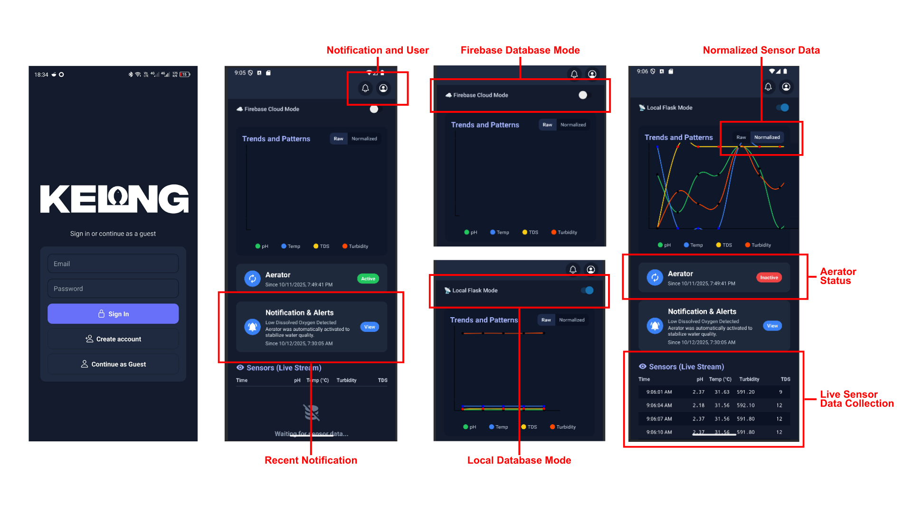
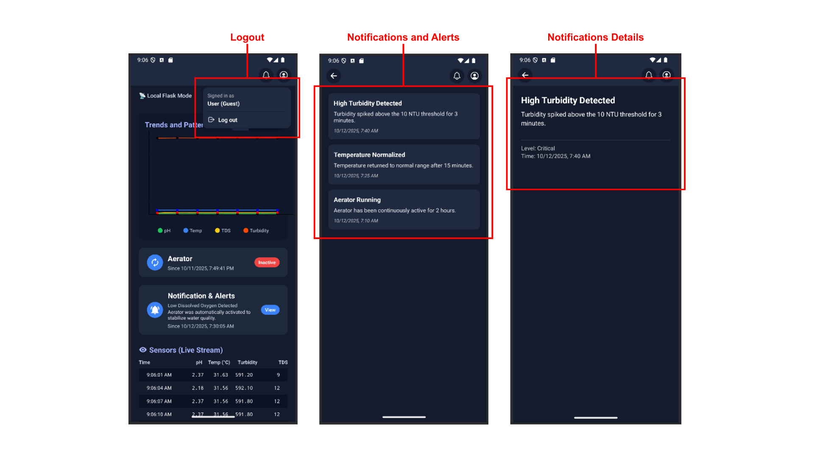

# KELONG: Mobile Application for the Design of a Deep Learning-Based Water Quality Forecasting for Floating Fish Farms with Aeration Control

## Main Features
- dashboard
- notification
- aerator control system

## System Overview
 
 