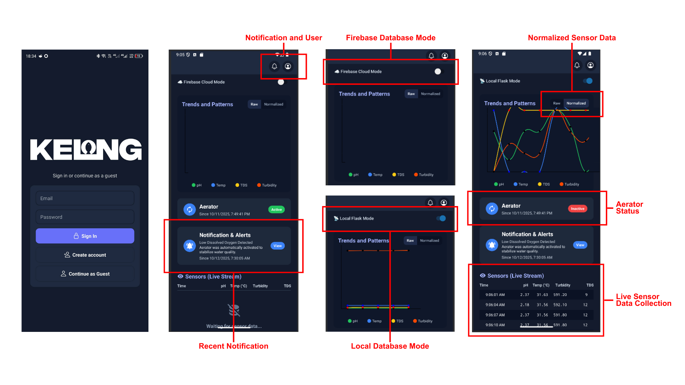
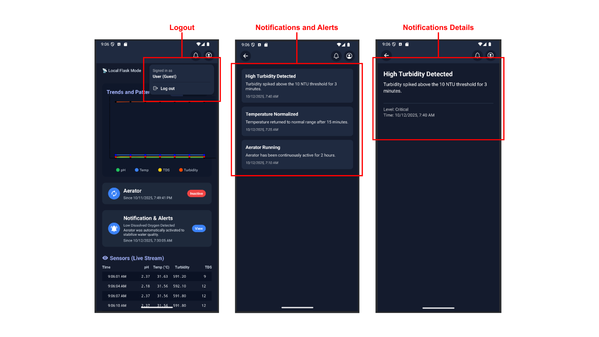

<h1 align="center">🐟 KELONG</h1>
<h3 align="center">Mobile Application for Deep Learning-Based Water Quality Forecasting for Floating Fish Farms with Aeration Control</h3>

  
  
  
  
  

---

## 📖 Overview

**KELONG** is a water quality monitoring software-hardware system built as a preventive measure against early fish kills in floating fish farms. Using a network of water quality sensors paired with a deep learning forecasting model, the system predicts upcoming water quality conditions and flags risks that could be detrimental to fish health — giving fish farm operators time to act before conditions become critical. The mobile app also lets operators control an aeration system remotely to help stabilize water quality in response to forecasted risks.

## ✨ Main Features

- 📊 **Dashboard** - real-time and forecasted water quality parameters at a glance
- 🔔 **Notifications** - early-warning alerts when forecasts indicate risk to fish health
- 💨 **Aerator Control** - remote control of aeration hardware to respond to water quality risks

## 🛠️ Tech Stack

| Category | Tools |
|---|---|
| Mobile App | React Native |
| Hardware | Embedded Systems, Water Quality Sensors |
| Data & Modeling | Python, Jupyter Notebook |

## 🖥️ System Overview

  
  

